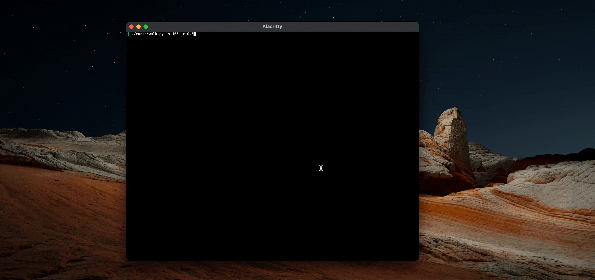

# cursorwalk
[Random walk](https://en.wikipedia.org/wiki/Random_walk) implementation on the mouse cursor, as a screensaver!




# Dependencies

[pyautogui](https://en.wikipedia.org/wiki/Random_walk) is required

```bash
pip install -r requirements.txt
```

## Linux

You may need to install `python-Xlib` and `python-tk` before installing `pyautogui`.

## MacOS

You need to give accessibility permissions to the terminal you're running the script from via Security Preferences, i.e. `Security & Privacy > Privacy > Accessibility`.

## Windows

Windows does not need any dependancies for `pyautogui` to work.

# Run

``./cursorwalk.py``

Runs with default options: `stepsize = 10` `ratespeed = 0.2` `timeout = 0`

## Options

```bash
$ ./cursorwalk.py --help
usage: cursorwalk.py [-h] [-s STEPSIZE] [-r RATESPEED] [-t TIMEOUT]

optional arguments:
  -h, --help            show this help message and exit
  -s STEPSIZE, --stepsize STEPSIZE
                        pixel stepsize
  -r RATESPEED, --ratespeed RATESPEED
                        seconds between each pixel move
  -t TIMEOUT, --timeout TIMEOUT
                        timeout for idle mouse to start random walk (seconds)

```

Cursorwalk can be run as a screensaver-type service, i.e., with the timeout `-t` option. The random walk won't start until the mouse is idle for the amount of seconds given. If the mouse is moved by the user (greater than the stepsize distance), the timeout will restart.

## Example
Run cursorwalk to move 20 pixels, with 0.2 seconds between each pixel, with a timeout of 15 minutes.

`./cursorwalk.py -s 20 -r 0.2 -t 900`
